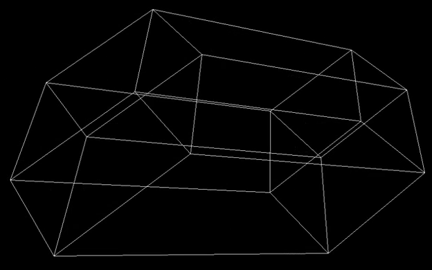
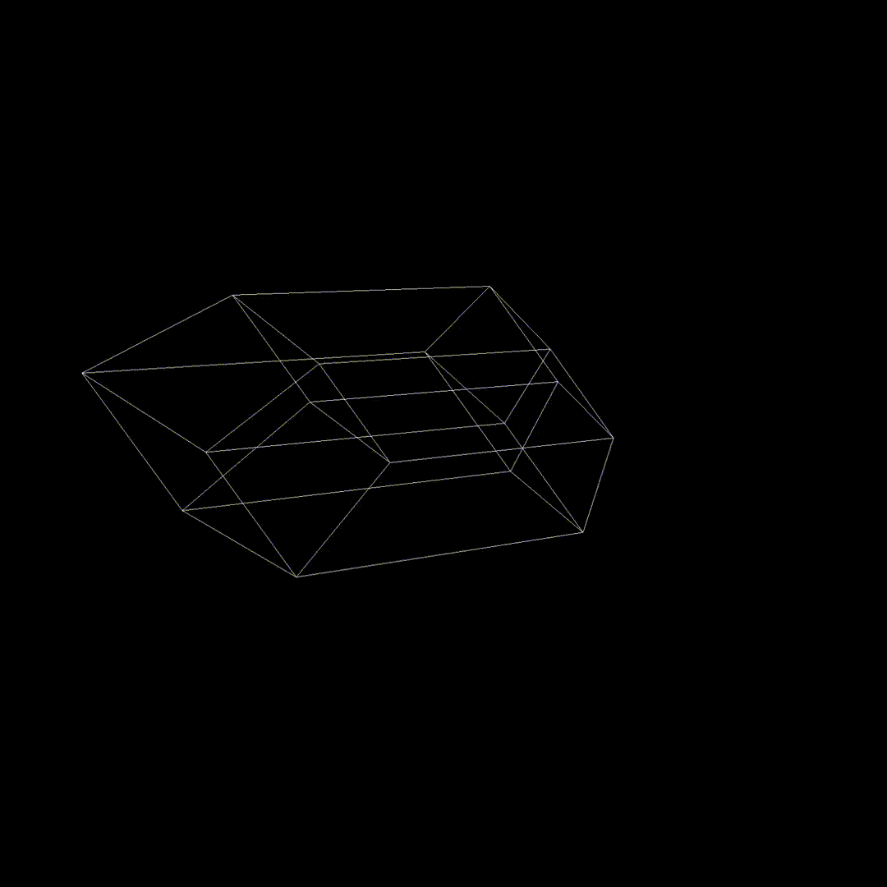
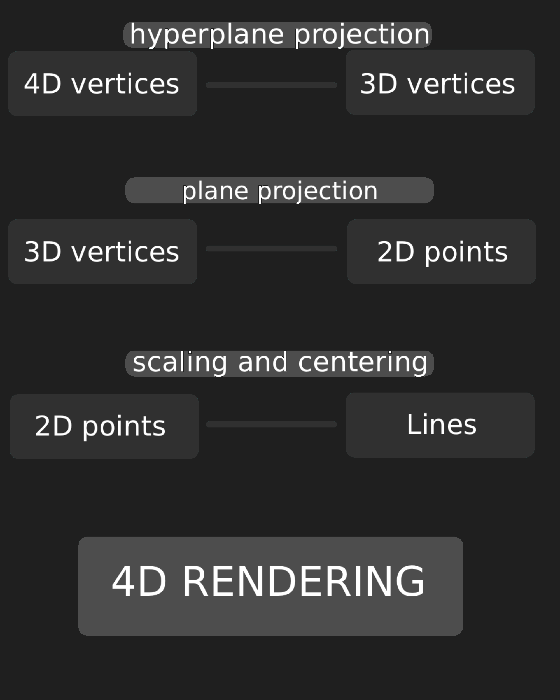
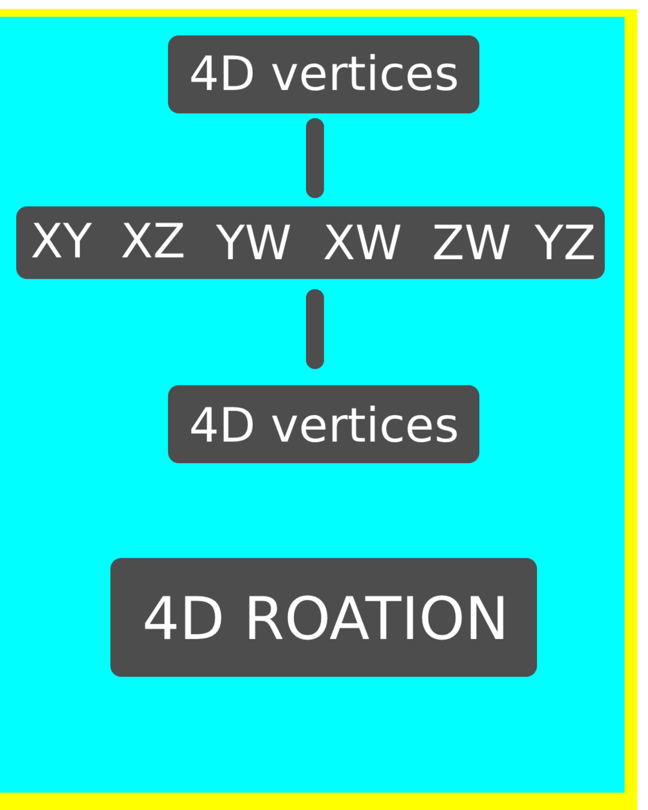

# 4d-render
A 4D render with its own file format '.dots' reading four dimensional data in a specific format then projecting it into 3D coordinates and then projecting those to 2D points and rendering these at last. along with 4D rotation 

## Features

- 4D vertices
- Edges and triangular surfaces
- 4D → 3D perspective projection
- 3D → 2D perspective projection
- Rotation in all six 4D planes
- Camera movement in four dimensions
- Custom `.dots` geometry format

## Controls

| Key | Action |
|---|---|
| C / C | Toggle between camera rotation or object rotation
| W / S | Move camera along Y |
| A / D | Move camera along X |
| Q / E | Move camera along Z |
| Z / X | Move camera along W |
| R / F | Rotate XY |
| T / G | Rotate XZ |
| Y / H | Rotate XW |
| U / J | Rotate WZ |
| I / K | Rotate WY |
| O / L | Rotate ZY |

## 4D Rotation

## `.dots` format

Vertices:

    v x y z w

Edges:

    e vertex1 vertex2

Surfaces:

    s vertex1 vertex2 vertex3

## how does it work
This project uses plane/hyperplane projection to turn 4D vertices into 2D points on a normal screen.

The rotation is simply rotating along rotation planes:

    

## how to use
install requirements:
     pip install -r requirements.txt
   
load you data into data.dots
   
and run 4d_render.py

you might have to tackle a bit with the position and rotation to see the tesseract 

The project is right now educational and therefore fully free of any licensing.
